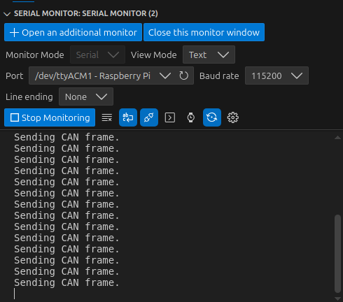
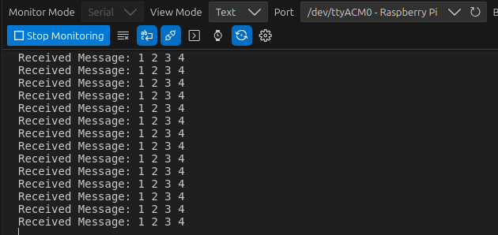
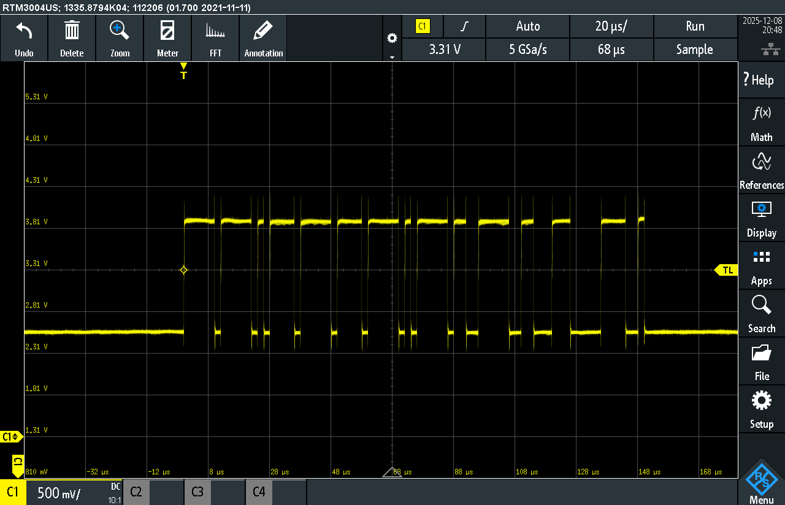
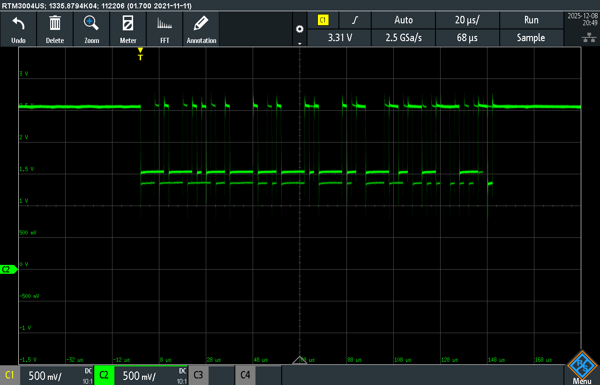
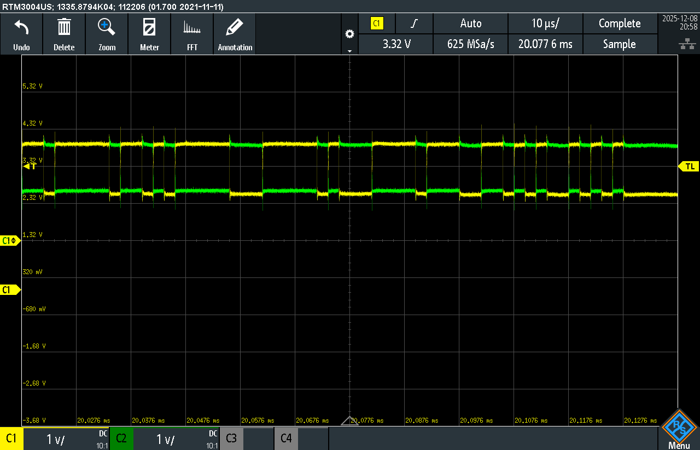
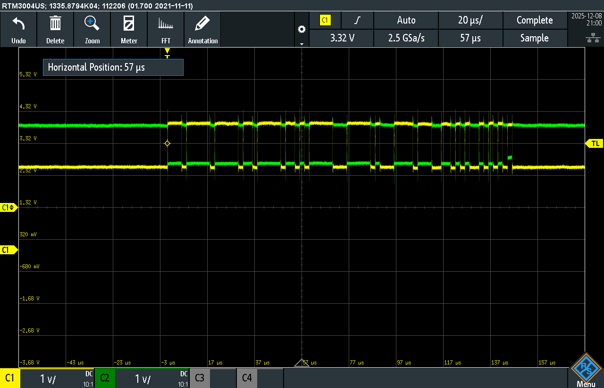

## Activity 1

#### Images of a message being sent and recieved through the CAN bus.

#### Broadcasting a babble noise with high priority and an important message with low priority.

##### Utilizing a short delay of 10 ms, we got a small amount of the important message to send.

##### When the delay was increased to 100 ms, we could further see more important messages making it through the babbling noise.

##### As we got up to a 1 second delay on the babbling noise, we were able to completely get an even breakthrough of noise and important messages.

